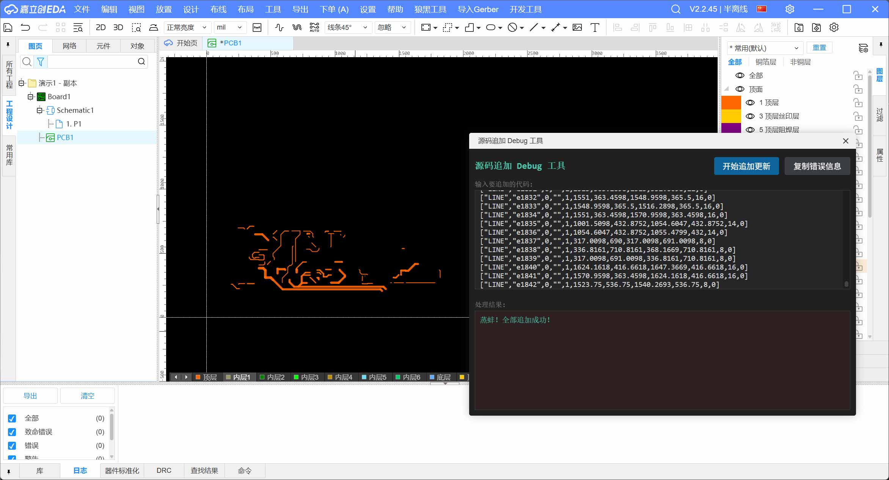

# 源码追加 Debug 工具

### [点击查看：演示视频](https://pbt-pub.jlc.com/pbt/bbs/8705937944942686208-20260131_195316.mp4)



## 为什么需要这个插件？

如果你在做 EDA 源码级开发，一定被下面这个场景折磨过

当你写的代码生成了几百行图元源码，满怀期待地点击导入时，编辑器日志只冷冰冰地弹出一个

```
2026-01-31 16:52:45  [错误] : 格式错误。
```

没有行号，没有错误位置，甚至没有一点提示。这时候你只能像原始人一样，用“二分法”或者一行一行删源码来人肉排查到底是哪一行源码不对，或者哪个参数不对。

**这个插件就是为了结束这种“修仙”式的找错过程。**

## 它能帮你做什么？

它的原理很简单：**它会帮你把源码一行一行地尝试“喂”给系统。**

1. **逐行校验**：它会自动读取当前文档内容，并将你输入的源码逐行进行追加尝试。
2. **精准定位**：如果某一行源码格式不对，系统报错了，会立刻把它拦截并记录下来。
3. **结果复盘**：跑完之后，哪些行是“害群之马”会一目了然地显示在错误框里。你只需要复制这些错误行去检查格式，就可以针对性的修改代码。

---

## 如何使用？

1. **安装插件**：安装并打开“源码追加 Debug 工具”。
2. **粘贴代码**：在上面的输入框里，粘贴你那堆报错的、或者需要检测的图元源码。
3. **开始运行**：点击【开始追加更新】。
    - 你会看到按钮上实时显示处理进度（比如 `处理中 15/100`）。
    - 如果一切顺利，你会看到满屏的“蒸蚌！没有错误！”。
    - 如果报错了，错误的代码会直接出现在下方的红色区域。
4. **修复**：点击【复制错误信息】，把有问题的代码拿去修改，修复后再跑一遍。

---

## 示例

### 正确情况

输入要追加的代码:

```
["LINE","e15024",0,"",1,32,92,127,92,10,0]
["LINE","e15025",0,"",1,127,92,151,116,10,0]
```

处理结果：

```
蒸蚌！没有错误！
```

### 错误情况

输入要追加的代码:

```
["LINE","e15024",0,"",1,32,92,127,92,10,0]
["LINE","e15025",0,"",3,127,92,151,116,10,0]
```

处理结果：

```
["LINE","e15025",0,"",3,127,92,151,116,10,0]

萝卜！萝卜！萝卜！
```

---

## 一点小提示

**关于性能**：因为是逐行与系统交互，代码量特别大（比如几千行）时，需要一点点耐心，它正在后台努力帮你探路。  
**关于V2版本**：实测功能一切正常没有问题，源码数量多了EDA可能会卡  
**关于V3版本**：在V3版本上，制造了一些错误源码，写入时也返回了ture成功，但是没有正确处理，等待官方修复

---

希望这个小工具能帮你省下掉头发的时间，祝你撸码愉快！
